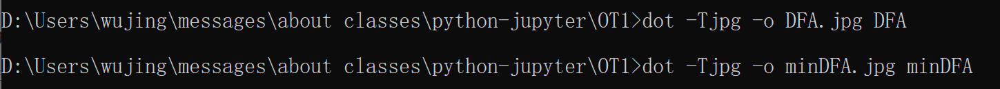
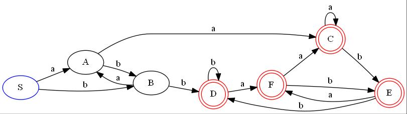
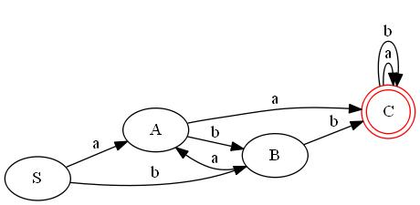

## <center>OT1实验报告</center>
<center>姓名：吴静</center>
<center>学号：2113285</center>
<center>专业：信息安全</center>

### 一、实验背景

**DFA最小化**：优化`DFA`，使状态数最少，将所有不可区分的状态合并成一个状态。

- 可区分：对于任何两个状态`t`和`s`，输入字符串`ω`，若从一状态出发接受`ω`，而从另一状态出发不接受`ω`；或者从`t`出发和从`s`出发到达不同的接受状态，则称`ω`对状态`t`和`s`是可区分的。
- 不可区分：设想任何输入序列`ω`对`s`和`t`均是不可区分的，则说明从`s`出发和从`t`出发，分析任何输入序列`ω`均得到相同结果，此时`s`和`t`可以合并成一个状态。

### 二、算法设计

#### （1） Hopcroft算法

此次实验采用`Hopcroft`算法，伪代码如下：
```c
split(S)
    foreach(character c)
        if(c can split s)
            split s into T1, ..., Tk

hopcroft()
    split all nodes into N, A
    while(set is still changes)
        split(s)
```

算法抽象：
```c
Q/θ ← {F, Q − F}
while (∃U, V ∈ Q/θ, a ∈ Σ) s.t. Equation 1 holds do
Q/θ ← (Q/θ − {U}) ∪ {U ∩ δ^-1(V, a), U − U ∩ δ^-1(V, a)}
end while
```

算法细化：
```c
W ← {F, Q − F}
P ← {F, Q − F}
while W is not empty do
    select and remove S from W
    for all a ∈ Σ do
        la ← δ^-1(S, a)
        for all R in P such that R ∩ la ≠ ∅ and R ∉ la do
            partition R into R1 and R2: R1 ← R ∩ la and R2 ← R − R1
            replace R in P with R1 and R2
            if R ∈ W then
               replace R in W with R1 and R2
            else
                if |R1| ≤ |R2| then
                    add R1 to W
                else
                    add R2 to W
                end if
            end if
        end for
    end for
end while
```

解释如下：
1. `F`代表终止状态集合，`Q`代表所有状态集合，`Q-F`代表非终止状态集合
2. `W`代表待处理的状态集合，`P`代表的是当前状态集合。
3. 对`W`中的每一个状态集合进行处理，处理前先移除当前要处理的状态
4. 对于所有可能的输入符号`a`，计算从当前选择的状态集合`S`经过输入符号`a`到达的新的状态集合`la`。
5. 检查新的状态集合`la`：如果`la`与当前状态集合`P`的任意子集存在交集且与该集合不等，则将`la`分隔成两个部分`R1`和`R1`，即`R`是可分的集合，可以分成两个集合`R1`和`R2`。
6. 在状态集合`P`中用`R1`和`R2`代替`R`。
7. 已知`R`可以用`R1`和`R2`替换，且`R`已经经过处理，所以在未处理状态集合`W`中，如果存在`R`，也要用`R1`和`R2`替代`R`。
8. 如果`W`中没有`R`，我们应该将`R1`和`R2`中更小的那个集合添加至待处理集合`W`中，因为`DFA`最小化的目的是减小等价类的大小，如果添加较大的子集可能会导致更大的等价类。
9. 重复处理`W`中剩下的状态直至`W`为空。

#### （2）Graphviz图形化表示

`Graphviz`可以用于可视化图形数据结构，它支持`python`调用，可以使用`Digraph`，`node`，`edge`，`render`等函数进行调用。

### 三、代码实现

这次的程序主要分成四个部分：
- 读取数据集，包括状态转移函数和终止状态集合。
- 进行`Hopcroft`算法，将读取进的`DFA`最小化，得到最小化状态集合。
- 将最小化状态集合重新分配状态名称并定义状态转移函数。
- 使用`Graphviz`进行图形化表示。

#### （1）读取数据集

**准备工作：**
- 状态转移函数--->data.txt
- 终结符列表--->endstate.txt

**读取状态转移函数文件data.txt：**
- 读取状态转移函数并存入`DFA`列表中
- 读入所有的输入字符组成输入字符集`paths`
- 读入所有的状态存入所有状态集合中
- 使用`dot`为有向图构造节点和有向边

代码如下：
```c
def getdata_dfa():
    global paths
    global DFA
    global allstatus
    global dot
    global endset
    
    #打开文件并读取数据
    f=open('data.txt')
    content=f.readlines()
    src_num=len(content)
    f.close()
    
    for i in range(src_num):
        temp=content[i].split()
        #temp是一个列表，其中有每一行的所有元素
        
        DFA.append(temp)
        paths.append(temp[1])
        allstatus.append(temp[0])
        allstatus.append(temp[2])
        
        if temp[0]==DFA[0][0]:
            if temp[0] not in endset:
                dot.node(name=temp[0],color='blue')
            else:
                dot.node(name=temp[0],color='blue',shape='doublecircle')
        elif temp[0] in endset:
            dot.node(name=temp[0],color='red',shape='doublecircle')
        else:
            dot.node(name=temp[0],color='black')
            
        dot.edge(temp[0], temp[2], temp[1])
    
    #使用集合去重
    paths=set(paths)
    allstatus=set(allstatus)
```

**读取终止状态集合文件endstate.txt：**
- 将终止状态集合保存于`endset`中

代码如下：
```c
def getdata_end():
    global endset
    
    f=open('endstate.txt')
    content=f.readlines()
    line_num=len(content)
    f.close()
    
    for i in range(line_num):
        endset.append(content[i][0])

    endset=set(endset)
```

上述两个文件均是采用`open`函数打开文件，然后使用`readlines`函数逐行读取，最后在`for`循环中依次处理。

至此，全局变量`paths`，`DFA`，`endstate`，`allstatus`全部赋值完毕。

#### （2）进行Hopcroft算法

这一部分是这次代码实现的重点，我根据算法设计中的伪代码进行实现的，首先来看一下代码实现：
```c
def hopcroft():
    global endset
    global allstatus
    global paths
    
    #初始化终止状态和非终止状态
    terminated_states=endset
    not_terminated_states=allstatus-terminated_states
    
    P = [terminated_states, not_terminated_states]
    # P 是状态分组的列表
    W = [terminated_states, not_terminated_states]
    # W 是待处理的状态的列表
    
    while W:
        #select and remove S from W
        S=W[0]
        W.remove(S)
        #选择一个A（未处理的状态集合的首部）
        #在W中移除（即将开始处理A）
        
        for path in paths:
            # 对每一个输入字符，查找对能转换到当前状态的状态集合la ← δ^-1(S, a)
            la=get_source_state(S,path)
            
            # 存储分隔后的新状态集合
            new_split_state=[]
            
            #for all R in P such that R ∩ la ≠ ∅ and R ∉ la do
            for R in P:
                condition1=R&la
                condition2=R-la
                
                if len(condition1) and len(condition2):
                    
                    #partition R into R1 and R2: R1 ← R ∩ la and R2 ← R − R1
                    #不能在这里直接对P进行操作，P在之后还要遍历呢
                    new_split_state.append(condition1)
                    new_split_state.append(condition2)
                
                    #if R ∈ W then
                    if R in W:
                        
                        #replace R in W with R1 and R2
                        W.remove(R)
                        W.append(condition1)
                        W.append(condition2)
                        
                    #else
                    else:
                        
                        #if |R1| ≤ |R2| then
                        if len(condition1)<=len(condition2):
                        
                            #add R1 to W
                            W.append(condition1)
                            
                        #else
                        else:
                            
                            #add R2 to W
                            W.append(condition2)

                else:
                    new_split_state.append(R)
                    
            #replace R in P with R1 and R2
            P=deepcopy(new_split_state)
    return P           
```

这里用到了`get_source_state()`函数，这个函数用于确定哪些状态可以通过相同的输入路径到达相同的目标状态，源码如下：
```c
def get_source_state(des_state_set,path):
    global allstatus

    #allStatus=set(allstatus)
    src_set=set()
    
    for state in allstatus:
        if move2(state,path) in des_state_set:
            src_set.update(state)
            #合并字典或集合的内容
            #如果在合并过程中有相同的键或元素，它将覆盖旧的键值对或元素
    
    return src_set
```

因为当两个状态可以通过相同的输入路径到达相同的目标状态时，它们被认为是等价的，可以合并到同一个等价类中，以此可以帮助将一个大的等价类分割成几个小的等价类，减少等价类的状态数量。

这个函数用到了一个函数`mov2()`，这个函数用于获取某一个状态通过某一个输入可以到达的新状态，源码如下：
```c
def move2(src,path):
    global DFA
    
    # 根据初始状态点和转移函数获取结束状态
    for i in range(len(DFA)):
        if(DFA[i][0]==src and DFA[i][1]==path):
            return DFA[i][2]
    return ' '
```

#### （3）重新分配状态名称并定义转移函数

在使用了`Hopcropt`算法最小化`DFA`后，我们得到了最小化的状态集合`minDFA`，接下来还有两个任务：
- 为每一个新的状态集合分配新状态名
- 在每一个输入下，重新分配当前状态到达的新状态（或者说状态名）

```c
def get_new_path():
    global minDFA
    global paths
    global result_DFA

    Paths=list(paths)
    MinDFA=list(minDFA)
    #将集合转换成列表，方便访问下标

    for i in range(len(MinDFA)):
        #对于每一个状态，找到其可以到达的新状态
        states=list(MinDFA[i])

        #用于存储新的DFA的每一种状态经过各path后到的新状态
        dst_states = [0] * len(Paths)

        for j in range(len(states)):
            #对于其中的每一个状态

            for path in range(len(Paths)):
                #对于每一种输入

                if dst_states[path]==0 and move2(states[j],Paths[path]) !=' ':
                    ptr=get_index_in_minDFA(move2(states[j],Paths[path]))
                    #ptr是当前状态当前输入下的新状态在minDFA中的索引值

                    dst_states[path]=min(MinDFA[ptr])
                    #此时要找到ptr索引值对应的minDFA的那一个状态数组的最小值（重新命名）

        for j in range(len(Paths)):
            if dst_states[j]!=0:
                temp=[]
                temp.append(min(minDFA[i]))
                temp.append(Paths[j])
                temp.append(dst_states[j])

                result_DFA.append(temp)
```

具体算法解释如下：
1. 遍历新状态集合中的每一个状态集合，为每一个状态集合定义一个列表，列表中存储在每种输入下，当前状态集合转移到的新状态，注意该列表初始化为0，用于分辨是否转移到的新状态不为空。
2. 遍历选择到的状态集合中的每一个状态。
3. 遍历每一种可能的输入字符。
4. 如果满足以下两个条件，则将当前状态集合中对应的输入该字符得到的新状态标号赋值：
    - 当前状态集合中对应的输入该字符得到的新状态标号为0
    - 当前状态通过输入该字符串得到的新状态不为空
5. 尤其要注意此时赋的值应该是分配后的新状态的值，此时规定分配后的新状态的值为等价类中的`ascii`值字符最小值，首先先找到查找到的状态对应的状态集合，然后使用min函数对新状态标号进行赋值。
6. 对状态集合中的每一个状态的操作完成之后，相当于是对该状态集合的操作完成，于是将结果加入到全局变量`result_DFA`中
7. 也要注意此时添加的源状态是当前状态集合的标号的最小值，相当于为当前状态进行编号，然后路径和到达的新状态在前面的循环中都有体现。

使用到的函数`get_index_in_minDFA()`可以查找指定状态的等价类在`minDFA`中的下标，源码如下：
```c
def get_index_in_minDFA(state):
    #找到当前状态state在minDFA中的索引值
    for i in range(len(minDFA)):
        if state in minDFA[i]:
            return i
    return ' '
```

#### （4）使用Graphviz进行图形化表示

由于`DFA`是个有向图，所以可以想到用`Graphviz`进行图形化表示，可以看到，在`getdata_dfa()`中有一段关于`dot`的初始化，在处理完第三步即运行完`get_new_path()`函数后也有这么一段用于初始化`dot2`：

```c
dot2 = Digraph("newDFA")
for i in range(len(result_DFA)):
    if result_DFA[i][0] in endset:
        dot2.node(name=result_DFA[i][0],color="red",shape='doublecircle')
    else:
        dot2.node(name=result_DFA[i][0],color="black")

    dot2.edge(result_DFA[i][0],result_DFA[i][2],result_DFA[i][1])
```

总结如下：
- 首先使用一个`Digraph()`函数，通过实例化一个`Digraphobject`创建一个图形。
- 添加点和边，可以通过`node()`和`edge()`来实现
- `node`的属性值有`shape`，`style`，`color`，`fillcolor`等
- `edge`的属性值有`label`，`color`，`fontcolor`，`dir`等
- 设置完毕后通过`render`函数渲染，设置`view=True`来显示得到的图形化界面的结果，默认生成`pdf`
- 本次实验规定：开始状态集合用蓝色节点表示，终止状态集合用红色+双实线状态集合表示。尔判断是否属于开始状态集合和终止状态集合都可以通过判断该状态是否是`DFA`中的首状态以及是否存在于`endstate`状态集合中。

### 四、实验结果

使用两个数据集进行测试：

#### （1）第一个测试

data.txt:

```
S a A
S b B
A a C
A b B
B a A
B b D
C a C
C b E
D a F
D b D
E a F
E b D
F a C
F b E
```

endstate.txt:

```
C
D
E
F
```
运行后得到结果，`DFA`，`minDFA`，`result_DFA`结果如下：
```
DFA:
['S', 'a', 'A']
['S', 'b', 'B']
['A', 'a', 'C']
['A', 'b', 'B']
['B', 'a', 'A']
['B', 'b', 'D']
['C', 'a', 'C']
['C', 'b', 'E']
['D', 'a', 'F']
['D', 'b', 'D']
['E', 'a', 'F']
['E', 'b', 'D']
['F', 'a', 'C']
['F', 'b', 'E']
minDFA:
{'E', 'C', 'D', 'F'}
{'A'}
{'B'}
{'S'}
result_DFA:
['C', 'a', 'C']
['C', 'b', 'C']
['A', 'a', 'C']
['A', 'b', 'B']
['B', 'a', 'A']
['B', 'b', 'C']
['S', 'a', 'A']
['S', 'b', 'B']
```

用如下两个命令行语句将`dot`文件转化成`jpg`文件：

<div style="text-align:center">
  
</div>


得到两个有向图如下：

DFA：

<div style="text-align:center">
  
</div>

minDFA:

<div style="text-align:center">
  
</div>

#### （2）第二个测试

data.txt:

```
A a B
A b C
B a B
B b D
C a B
C b C
D a B
D b E
E a B
E b C
```

endstate.txt:

```
E
```
运行后得到结果，`DFA`，`minDFA`，`result_DFA`结果如下：
```
DFA:
['A', 'a', 'B']
['A', 'b', 'C']
['B', 'a', 'B']
['B', 'b', 'D']
['C', 'a', 'B']
['C', 'b', 'C']
['D', 'a', 'B']
['D', 'b', 'E']
['E', 'a', 'B']
['E', 'b', 'C']
minDFA:
{'E'}
{'D'}
{'B'}
{'C', 'A'}
result_DFA:
['E', 'a', 'B']
['E', 'b', 'A']
['D', 'a', 'B']
['D', 'b', 'E']
['B', 'a', 'B']
['B', 'b', 'D']
['A', 'a', 'B']
['A', 'b', 'A']
```

得到两个有向图如下：

DFA：

<div style="text-align:center">
  
</div>

minDFA:

<div style="text-align:center">
  
</div>
